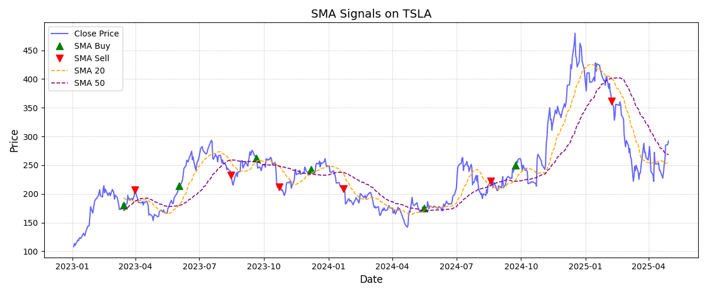

# Multi-Strategy Backtesting with Python | Quantitative Trading Module

This project provides a clean and modular backtesting engine for four popular trading strategies: Simple Moving Average (SMA) Crossover, MACD, RSI, and Bollinger Bands using Python, pandas, and yfinance. It simulates trades, tracks performance, and visualizes buy/sell points—ideal for traders, analysts, and quant developers.

---

## 📢 What's New

- **2025-06-03:** Added RSI and Bollinger Bands strategies. All four strategies now share a consistent, extensible codebase.
- **2025-06-01:** Added MACD strategy support.
- **2025-06-01:** Improved SMA strategy to ensure price series is always aligned after dropping NA values.

---

## 📈 Strategies Supported

### SMA Crossover
- **Buy signal:** When short-term SMA crosses **above** long-term SMA.
- **Sell signal:** When short-term SMA crosses **below** long-term SMA.

### MACD
- **Buy signal:** When MACD line crosses **above** the Signal line.
- **Sell signal:** When MACD line crosses **below** the Signal line.

### RSI
- **Buy signal:** When RSI falls **below** a lower threshold (e.g., 30).
- **Sell signal:** When RSI rises **above** an upper threshold (e.g., 70).

### Bollinger Bands
- **Buy signal:** When price crosses **below** the lower band.
- **Sell signal:** When price crosses **above** the upper band.

---

## 📊 Features

- Backtests SMA, MACD, RSI, and Bollinger Bands strategies using `yfinance`.
- **Fully customizable:** Adjust ticker, date range, and all strategy parameters to fit your needs.
- Tracks:
  - Buy/sell dates and prices
  - Profit per trade
- Calculates:
  - Total trades
  - Win rate
  - Average profit
  - Cumulative profit
- Optional plots showing:
  - Buy/Sell points
  - Indicator lines (SMA, MACD, RSI, Bollinger Bands)
  - Cumulative profit over time
- Modular code: Easily add or combine strategies.
- **Easily extendable:** More performance metrics, trade details, or strategy parameters can be added as required.

---

## 🛠️ Usage

All parameters are user-adjustable, so you can backtest any ticker or customize strategy settings.

```python
from backtesting import backtest

# SMA Example
results = backtest(
    ticker='AAPL',
    start_date='2024-01-01',
    end_date='2025-01-01',
    strategy='SMA',
    sma_short=20,
    sma_long=50,
    plot=True
)

# MACD Example
results = backtest(
    ticker='AAPL',
    start_date='2024-01-01',
    end_date='2025-01-01',
    strategy='MACD',
    macd_fast=12,
    macd_slow=26,
    macd_signal=9,
    plot=True
)

# RSI Example
results = backtest(
    ticker='AAPL',
    start_date='2024-01-01',
    end_date='2025-01-01',
    strategy='RSI',
    RSI_lower=30,
    RSI_upper=70,
    plot=True
)

# Bollinger Bands Example
results = backtest(
    ticker='AAPL',
    start_date='2024-01-01',
    end_date='2025-01-01',
    strategy='BOLLINGER',
    bb_window=20,
    bb_std=2,
    plot=True
)
```
---

## 👤 Real-World Use Case (Client-Style)

Suppose a client wants to analyze Apple's stock using a 20/50 SMA crossover strategy from Jan 2024 to Jan 2025.  
They’re interested in:
- When to buy/sell
- Profit from each trade
- Total performance
- Visual validation with a chart

This tool delivers all of that with a single function call using customizable parameters.  
The results include a detailed trade log, performance metrics, and a plotted chart of buy/sell points.

---

## 📁 Output Sample

| Buy Date   | Buy Price | Sell Date  | Sell Price | Profit | Cumulative_Profit |
|------------|-----------|------------|------------|--------|-------------------|
| 2024-05-16 | 178.65    | 2024-08-19 | 177.48     | -1.17  | -1.17             |
| 2024-09-23 | 252.64    | 2025-02-07 | 338.59     | 85.95  | 84.78             |

---

## 📝 Notes

- All strategies are implemented in a consistent, extensible framework.
- You can easily extend this code to add new strategies or combine signals for more robust trading logic.
- Example plots and trade logs are included for transparency and analysis.
- **More tracking fields and adjustable parameters can be added on request or as needed for custom strategies.**

---

## 📦 Requirements

- Python 3.x
- pandas
- yfinance
- matplotlib

Install requirements with:
```sh
pip install pandas yfinance matplotlib
```

---

## 📌 License

MIT License

---

## 📉 Example Chart (SMA Strategy)

This chart shows the buy/sell points for AAPL based on the 20/50 SMA crossover strategy:



---

## 📞 Contact

For custom strategy development or consulting, please contact me via this platform's messaging system.
